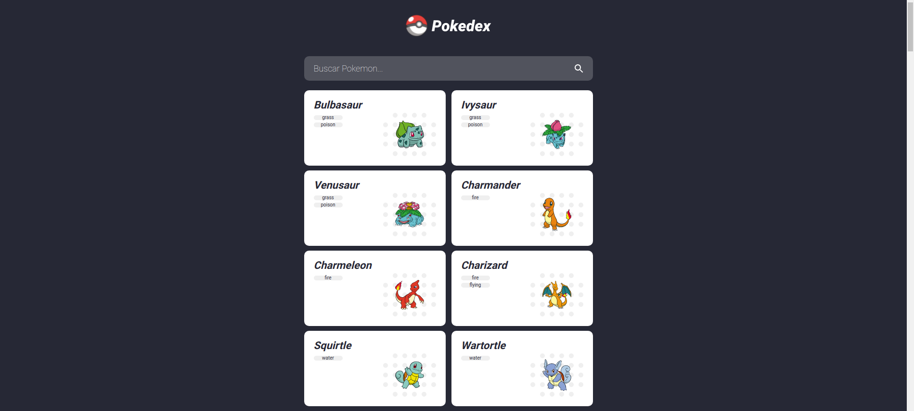
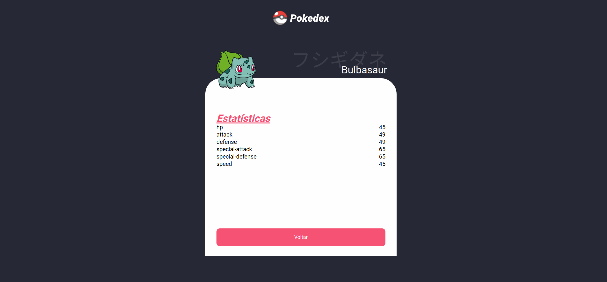

# PokedexAngular

Pokedex feita para adquirir conhecimento em requisições de uma api com o framework Angular.

## Desenvolvimento

Para rodar o projeto digite no terminal `ng serve` e e depois abra `localhost:4200`

## Imagem da tela inicial

## Imagem de estatisticas

